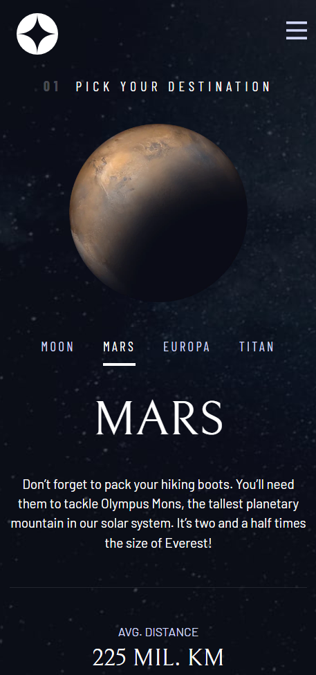

# Frontend Mentor - Space tourism website solution

This is a solution to the [Space tourism website challenge on Frontend Mentor](https://www.frontendmentor.io/challenges/space-tourism-multipage-website-gRWj1URZ3). Frontend Mentor challenges help you improve your coding skills by building realistic projects.

## Table of contents

- [Overview](#overview)
  - [The challenge](#the-challenge)
  - [Screenshot](#screenshot)
  - [Links](#links)
- [My process](#my-process)
  - [Built with](#built-with)
  - [What I learned](#what-i-learned)
  - [Useful resources](#useful-resources)
- [Author](#author)
- [Acknowledgments](#acknowledgments)

## Overview

### The challenge

Users should be able to:

- View the optimal layout for each of the website's pages depending on their device's screen size
- See hover states for all interactive elements on the page
- View each page and be able to toggle between the tabs to see new information

### Screenshot



### Links

- Solution URL: https://github.com/MaxPlummer/space-tourism
- Live Site URL: https://maxplummer.github.io/space-tourism/destination.html

## My process

### Built with

- Semantic HTML5 markup
- CSS custom properties
- Flexbox
- CSS Grid
- JavaScript
- Mobile-first workflow
- Accessibility features

### What I learned

I learned a lot about aria attributes and creating accessibility features. One such feature is the tab lists that allow users to users to use only keyboard inputs to explore all the different informational tabs on each page.
```html
<button
  aria-selected="true"
  role="tab"
  aria-controls="moon-tab"
  class="uppercase ff-sans-cond text-accent letter-spacing-2"
  tabindex="0"
  data-image="moon-image"
></button>
```

I also learned more about the CSS grid and creating templates to give each of the pages their specific layouts.
```css
.grid-container--destination {
  --flow-space: 2rem;
  grid-template-areas:
    "title"
    "image"
    "tabs"
    "content";
}
```

I learned more about event listeners in JavaScript and checking for specific types of user inputs, such as keyboard inputs. This also improves the accessibility by allowing users to use the arrow keys for tab navigation. 
```js
if (e.keyCode === keydownLeft || e.keyCode === keydownRight) {
  tabs[tabFocus].setAttribute("tabindex", -1);
  ...
```

### Useful resources

- [Scrimba Course](https://scrimba.com/build-a-space-travel-website-c014) - This is the course on Scrimba led by Kevin Powell that guided me through building this site. I was able to learn so much about modern web design and accessibility practices through this course.

## Author

- GitHub - [MaxPlummer](https://github.com/MaxPlummer)
- Frontend Mentor - [@MaxPlummer](https://www.frontendmentor.io/profile/MaxPlummer)
- LinkedIn - [Maxwell Plummer](https://www.linkedin.com/in/maxwell-plummer-1b2b13291/)

## Acknowledgments

A big thanks to Kevin Powell and Scrimba for providing an excellent and insightful learning opportunity for prospective web developers like myself.
